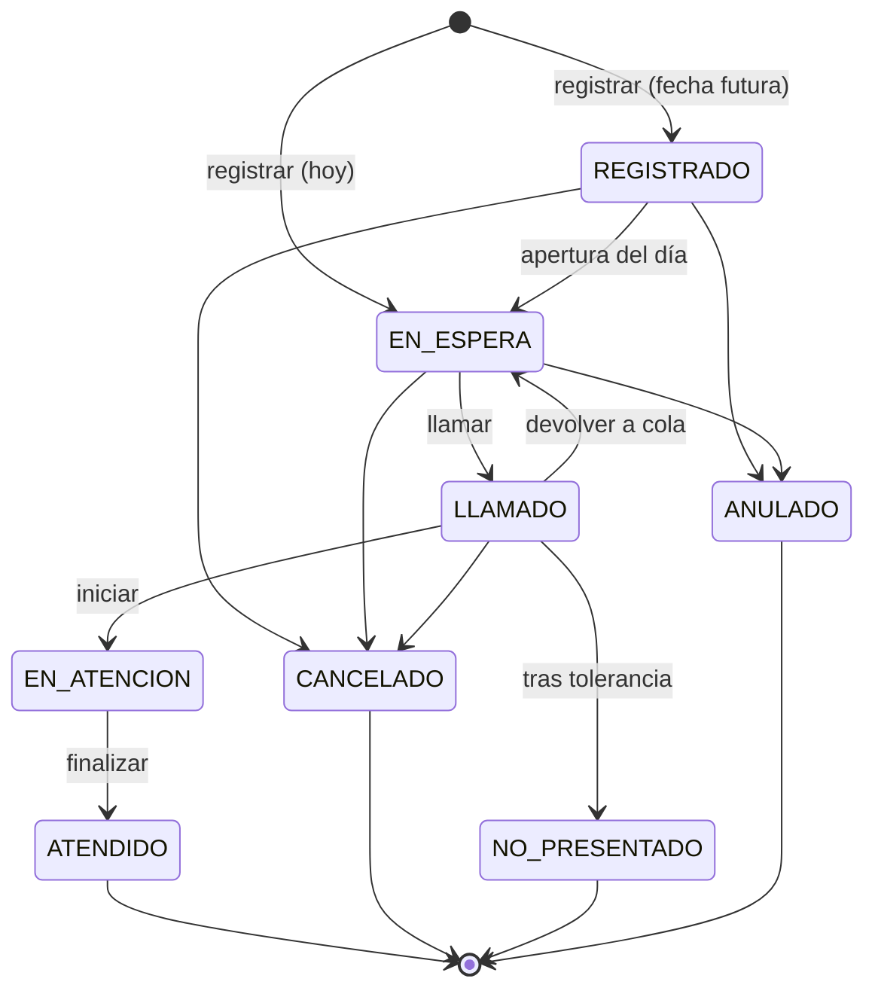
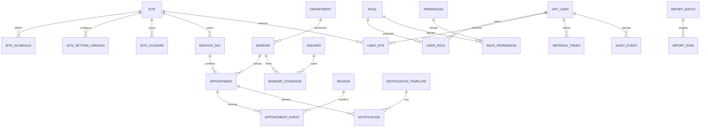

# Sistema Integral de Gestión de Atención del Tópico de Salud — CSJ Lima

## Documento de Análisis y Diseño (Etapas 1–9) · v0.1 · Borrador para aprobación

> Estado: **pendiente de validación**. Ningún código se genera hasta aprobar este documento
> y responder las preguntas de la sección 3.

---

## Índice

1. Entendimiento del problema
2. Supuestos
3. Preguntas pendientes
4. Reglas de negocio
5. Máquina de estados de la atención
6. Arquitectura propuesta y decisiones técnicas
7. Modelo de datos (ER + diseño PostgreSQL)
8. Concurrencia e integridad
9. Diseño de la API REST
10. Seguridad y privacidad
11. Auditoría, logs y observabilidad
12. Notificaciones
13. Importación de Excel
14. Arquitectura frontend
15. Diseño UX/UI
16. Despliegue, backup y restauración
17. Estrategia de pruebas
18. Plan de implementación incremental

---

## 1. Entendimiento del problema

La encargada del tópico (una por sede) recibe solicitudes por teléfono o en persona, anota
datos en Excel y controla de memoria los cupos, el orden y los estados. No hay trazabilidad,
no hay control concurrente de cupos entre dos personas y no hay estadísticas confiables.

El sistema es **administrativo y operativo**: gestiona *quién* pidió atención, *cuándo*, *en
qué orden*, *qué pasó con su turno* y *quién hizo cada acción*. **No** registra el *porqué*
médico ni el resultado clínico. Eso le corresponde a la Clínica Internacional.

**Actores en la Fase 1**

| Actor | Rol en el sistema |
|---|---|
| Encargada del tópico | Opera la mesa de su sede: busca, registra, llama, inicia, finaliza, cancela y marca no presentado. |
| Supervisor(a) | Ve ambas sedes, reportes y exportaciones, y configura su sede. |
| Administrador(a) del sistema | Usuarios, roles, parámetros, catálogos, importaciones. No opera la cola por defecto. |
| Auditor(a) | Solo lectura de auditoría y reportes. |
| Trabajador(a) | No inicia sesión. Consulta el estado de su turno (pantalla pública limitada). Recibe correos. |
| Personal de la Clínica Internacional | **No es usuario del sistema** en la Fase 1 (supuesto S7). |

**Criterio de éxito:** que la encargada deje de usar Excel en la operación diaria.

---

## 2. Supuestos

Se usan para diseñar, pero cada uno debe confirmarse.

| # | Supuesto |
|---|---|
| S1 | Cada sede tiene **un solo punto de atención** (un médico), así que hay como máximo 1 atención `EN_ATENCION` a la vez por sede. Es un parámetro configurable. |
| S2 | La **capacidad es diaria por sede** y no por bloque (mañana/tarde). |
| S3 | El turno es un **número de orden** y no una cita a hora fija. La "hora estimada" se calcula en forma dinámica y es solo referencial. |
| S4 | En la Fase 1 solo se registran atenciones **para el mismo día**. Dejamos un parámetro `dias_anticipacion_max` en 0 para habilitar fechas futuras más adelante sin cambiar el modelo. |
| S5 | El identificador es DNI de 8 dígitos. El modelo admite otros tipos de documento (CE) por si existieran. |
| S6 | El servidor es **on-premise en la LAN**, sin Internet garantizado. Hay un servidor SMTP institucional accesible desde la LAN. |
| S7 | El personal médico no usa el sistema. Es la encargada quien marca inicio y fin. |
| S8 | Un trabajador tiene como máximo **una atención activa por día** (en cualquier sede). |
| S9 | Los trabajadores **no** consultan desde fuera de la red institucional en la Fase 1. |
| S10 | El Excel de trabajadores EPS Rímac es la **fuente de verdad** de la habilitación y se reemplaza o actualiza por importación periódica. |

---

## 3. Preguntas pendientes (bloqueantes marcadas con ★)

1. ★ **Archivos Excel reales**: necesito una muestra (puede ser anonimizada) de la relación EPS
   Rímac y del histórico de atenciones. El diseño de la importación y de la migración depende de sus columnas.
2. ★ **Servidor**: ¿qué sistema operativo usa el servidor institucional (Windows Server / Linux)?
   ¿Existe IIS o algún proxy inverso estándar? ¿Hay certificado TLS interno?
3. ★ **Orden vs. hora**: ¿al trabajador se le da solo un número de turno, o también una hora
   referencial comprometida? (Supuesto S3).
4. ★ **¿Registro para días futuros?** (Supuesto S4). ¿Alguien llama hoy pidiendo atención para mañana?
5. ¿Cuántos médicos o consultorios hay por sede? (S1)
6. ¿La capacidad se divide entre mañana y tarde, o es un único cupo diario? (S2)
7. ¿Un **NO_PRESENTADO** puede volver a registrarse el mismo día? ¿Y alguien que canceló?
8. Si el trabajador llega tarde tras ser llamado (dentro de la tolerancia), ¿se atiende o vuelve a la cola?
9. ¿Existen **feriados, días no laborables o cierres** del tópico que deban bloquear registros?
10. ¿La consulta del trabajador será accesible desde su celular (Wi-Fi institucional / Internet)?
11. ¿Hay un SMTP institucional con cuenta de envío? (host, puerto, TLS, remitente).
12. ¿Existe un manual de identidad visual del Poder Judicial (logo, colores) que debamos usar?
13. ¿Hay algún lineamiento institucional sobre retención de datos y sobre la Ley N.° 29733
    (Protección de Datos Personales) para el área de bienestar/salud?
14. ¿Se tiene fecha de nacimiento en la fuente? Se recomienda guardarla en lugar de la "edad",
    que cambia con el tiempo y se calcularía.
15. ¿"Dependencia" viene como catálogo oficial (código + nombre) o como texto libre?

---

## 4. Reglas de negocio

### 4.1 Elegibilidad
- **RN-01** Solo se registra atención para un trabajador que exista, esté **activo** y tenga
  cobertura EPS Rímac **vigente** a la fecha de atención.
- **RN-02** La encargada no puede crear trabajadores "al vuelo" desde la mesa de operación.
  El alta o modificación de trabajadores es una función administrativa separada y auditada.
- **RN-03** Si no es elegible, el sistema indica el motivo (no existe / inactivo / sin cobertura
  vigente) sin exponer más datos de los necesarios.

### 4.2 Capacidad
- **RN-04** Cada sede tiene capacidad diaria configurable. Ningún valor se codifica en el código.
- **RN-05** Ocupan cupo los estados `REGISTRADO, EN_ESPERA, LLAMADO, EN_ATENCION, ATENDIDO`.
- **RN-06** Liberan cupo `CANCELADO, NO_PRESENTADO, ANULADO`.
- **RN-07** Al alcanzar la capacidad se rechaza el registro con el mensaje: *"Se ha alcanzado la
  capacidad máxima de atención para esta sede en la fecha seleccionada."*
- **RN-08** La capacidad de un día se **congela** al abrir ese día (primer registro). Si luego cambia la
  configuración, el cambio aplica desde el día siguiente. Si se requiere ajustar el día en curso,
  hay una acción explícita y auditada (“ajustar capacidad del día”), permitida solo a supervisor.

### 4.3 Turno y orden
- **RN-09** El número de turno es correlativo **por sede y por día**, sin reutilización, y tiene formato
  `{prefijo_sede}-{NNN}` (ej. `A-009` Alzamora, `B-004` Barreto). El prefijo es configurable.
- **RN-10** El orden de la cola es el **orden de registro** (número de turno). No hay reordenamiento.
- **RN-11** “Llamar siguiente” toma el menor número en `EN_ESPERA`.
- **RN-12** Una atención llamada que se “devuelve a la cola” **conserva su número** y, por tanto, su
  posición original. Esta acción queda auditada.
- **RN-13** Cualquier prioridad futura (p. ej., gestantes) será una regla explícita, parametrizada
  y auditada. **No existe en la Fase 1.**

### 4.4 Horario
- **RN-14** Cada sede define bloques de atención por día de semana (mañana/tarde), duración de
  turno (minutos) y tolerancia (minutos).
- **RN-15** No se registra fuera del horario de registro de la sede ni en días cerrados.
- **RN-16** Hora estimada = `max(ahora, inicio del bloque) + (personas delante × duración)`,
  saltando el intervalo entre bloques. Es **referencial** y se recalcula en cada consulta.

### 4.5 Unicidad
- **RN-17** Un trabajador no puede tener dos atenciones activas el mismo día (garantizado por la BD).

### 4.6 Cancelación, no presentación y anulación
- **RN-18** Cancelar exige motivo (catálogo) y admite observación opcional. Nunca se elimina el registro.
- **RN-19** `NO_PRESENTADO` solo se permite desde `LLAMADO` y después de transcurrida la tolerancia
  desde el llamado. Antes de ese momento el botón aparece deshabilitado y muestra una cuenta regresiva.
- **RN-20** `ANULADO` corrige un **error de registro** (persona equivocada, duplicado). Requiere motivo y
  solo aplica a atenciones que aún no se iniciaron. En los reportes se excluye de la demanda real.
- **RN-21** Reprogramar **no es un estado**: se cancela con motivo “Reprogramación” y se registra una
  nueva atención vinculada (`origin_appointment_id`). Así el orden y los cupos se mantienen coherentes.
- **RN-22** La posibilidad de volver a registrarse el mismo día tras `NO_PRESENTADO`/`CANCELADO` es un parámetro por sede.

### 4.7 Alcance por sede
- **RN-23** Un usuario solo opera las sedes que tiene asignadas. Esto se valida en el backend en cada
  operación, no solo en la interfaz.

### 4.8 Datos
- **RN-24** No se almacenan síntomas, diagnósticos, motivos médicos ni resultados. El campo de
  observación es administrativo y la interfaz advierte que no se debe registrar información clínica.

---

## 5. Máquina de estados de la atención

Análisis de los estados opcionales:
- **ANULADO: se incluye.** Distingue un error administrativo de una cancelación real del trabajador.
  Sin él, los reportes de cancelación se contaminan.
- **ERROR_REGISTRO: no se incluye.** Es redundante con ANULADO más su motivo.
- **REPROGRAMADO: no se incluye como estado.** Ver RN-21.
- **REGISTRADO vs EN_ESPERA:** `REGISTRADO` se reserva para atenciones de fechas futuras (S4). Un
  registro para hoy entra directamente en `EN_ESPERA`. Así el modelo ya soporta la Fase 2 sin cambios.



| Desde \ Hacia | EN_ESPERA | LLAMADO | EN_ATENCION | ATENDIDO | CANCELADO | NO_PRESENTADO | ANULADO |
|---|---|---|---|---|---|---|---|
| REGISTRADO | ✔ sistema | | | | ✔ motivo | | ✔ motivo |
| EN_ESPERA | | ✔ | | | ✔ motivo | | ✔ motivo |
| LLAMADO | ✔ | | ✔ | | ✔ motivo | ✔ tolerancia | |
| EN_ATENCION | | | | ✔ | | | |
| Finales | — | — | — | — | — | — | — |

La tabla de transiciones vive en **un solo módulo del dominio** (backend). Cada transición:
valida el permiso y la sede → valida la transición → actualiza la atención (con control de versión) →
inserta el evento en `appointment_event` → inserta la auditoría → encola la notificación. Todo ocurre en **una transacción**.

---

## 6. Arquitectura propuesta

### 6.1 Estilo: **monolito modular**

| Opción | Evaluación |
|---|---|
| Microservicios | ❌ Sobreingeniería para 2 sedes y unos 10 usuarios. Más operación y más puntos de falla. |
| Monolito sin estructura | ❌ Difícil de mantener y de evolucionar. |
| **Monolito modular** (un proceso y una BD, con módulos por dominio y límites claros) | ✅ **Recomendado.** Simple de desplegar en la LAN y permite extraer módulos más adelante si hiciera falta. |

```
┌───────────── Navegador (LAN) ─────────────┐
│ SPA React + TS (archivos estáticos)       │
└──────────────┬────────────────────────────┘
               │ HTTPS (mismo origen: /  y /api)
┌──────────────▼────────────────────────────┐
│ Proxy inverso (Caddy / IIS / Nginx)       │  TLS, estáticos, cabeceras de seguridad
└──────────────┬────────────────────────────┘
               │ http://127.0.0.1:8000
┌──────────────▼────────────────────────────┐
│ FastAPI (Uvicorn) — monolito modular      │
│  auth · users · sites · workers · agenda  │
│  appointments/queue · notifications       │
│  imports · reports · audit · admin        │
│  + worker interno de notificaciones       │
└──────────────┬──────────────┬─────────────┘
               │              │ SMTP
        ┌──────▼──────┐   ┌───▼────────────┐
        │PostgreSQL 16│   │SMTP institucional│
        └─────────────┘   └────────────────┘
```

### 6.2 Decisiones técnicas (con justificación)

| Tema | Decisión | Alternativa descartada y por qué |
|---|---|---|
| Backend | Python 3.12 + FastAPI + Pydantic v2 | Requerido. |
| ORM | **SQLAlchemy 2.0 (API tipada), modo síncrono** + psycopg 3 | Async: más complejo de probar y depurar, y sin beneficio real con esta carga (decenas de usuarios). FastAPI ejecuta los endpoints síncronos en un threadpool. |
| Migraciones | **Alembic** (DDL versionado) | Script SQL manual: sin versionado ni rollback. Igual se entregará un `schema.sql` generado para revisión del DBA. |
| Hash de contraseñas | **Argon2id** (argon2-cffi) | bcrypt: válido, pero Argon2id es la recomendación actual de OWASP. |
| Sesión | **Access token JWT corto (15 min) en memoria + refresh token opaco en cookie `HttpOnly; Secure; SameSite=Strict`**, rotado y guardado con hash en BD (revocable) | JWT en localStorage: vulnerable a XSS. Sesión de servidor pura: válida, pero la combinación elegida facilita la Fase 3 (LDAP) y los clientes futuros. |
| CSRF | El refresh usa una cookie SameSite=Strict más la cabecera `X-Requested-With` obligatoria; la API usa Bearer (no hay cookies en las demás rutas) | — |
| Autenticación extensible | Interfaz `AuthProvider` (`LocalAuthProvider` ahora, `LdapAuthProvider` en la Fase 3) | — |
| Cola en tiempo real | **Polling cada 5 s con TanStack Query** (solo con la pestaña visible) | WebSocket/SSE: con varios workers de Uvicorn requiere pub/sub. Hoy no se justifica. Queda listo para SSE con `LISTEN/NOTIFY` en el futuro. |
| Notificaciones | **Patrón outbox** en PostgreSQL + worker interno (hilo) con reintentos | Celery/Redis: la sección 46 prohíbe colas externas. El outbox garantiza que no se envíe un correo de una transacción revertida. |
| Rate limiting | `slowapi` en memoria (login, consulta pública) | Redis: innecesario con un solo servidor. |
| Logs | JSON estructurado (`structlog`) con `request_id`, rotación diaria | — |
| Exportación | Excel (`openpyxl`) y CSV; PDF en una fase posterior | PDF requiere motor de render; el valor es bajo para la Fase 1. |
| Frontend | React 18 + TypeScript estricto + Vite | Requerido. |
| Estado servidor | TanStack Query | Redux: innecesario, porque casi todo es estado del servidor. |
| Formularios | React Hook Form + Zod | — |
| UI | Tailwind CSS + primitivas accesibles Radix UI + **design system propio** (tokens institucionales) | MUI/Ant: aspecto de “plantilla genérica”, que la sección 34 pide evitar. |
| Recursos offline | Fuentes e íconos (lucide) empaquetados en el build, sin CDN | — |
| Idioma | **Código, BD y API en inglés** (snake_case en BD, convención de las librerías); **interfaz, mensajes y documentación en español**, con glosario | Todo en español: mezcla inevitable con el framework (`created_at` vs `fecha_creacion`). Es una decisión que el equipo puede revertir si lo prefiere. |

### 6.3 Estructura del backend

```
backend/
  app/
    main.py                  # solo crea la app y registra routers/middlewares
    core/                    # config (pydantic-settings), db, security, errors, logging, clock/timezone
    shared/                  # tipos comunes, paginación, validadores (DNI), enums
    modules/
      auth/        router.py schemas.py service.py providers/
      users/       router.py schemas.py models.py service.py repository.py
      sites/       ...       (sedes, horarios, parámetros por sede)
      workers/     ...       (trabajadores, dependencias, coberturas EPS)
      agenda/      ...       (día operativo, capacidad, numeración)
      appointments/ ...      (atenciones, máquina de estados, cola)
      notifications/ ...     (outbox, plantillas, canales: email/)
      imports/     ...       (staging, validadores, confirmación)
      reports/     ...
      audit/       ...
      admin/       ...       (catálogos, parámetros)
  alembic/
  tests/  unit/ integration/ concurrency/
```

Reglas: el router solo traduce HTTP ↔ servicio; el servicio contiene la lógica y maneja la transacción;
el repository concentra las consultas. Ningún módulo accede directamente a las tablas de otro, sino a través de su servicio.

---

## 7. Modelo de datos

### 7.1 Estrategia de tiempo (zona horaria)
- Todos los instantes se guardan como `timestamptz` (internamente en UTC).
- La **fecha operativa** (`service_date`) es `date` y se calcula en `America/Lima` (UTC−5, sin horario de verano) en el backend, mediante un único `Clock` inyectable (así las pruebas pueden fijar la hora).
- Las horas de horario (`08:00`) son `time` sin zona y se interpretan en la zona de la sede (columna `timezone`, por defecto `America/Lima`).
- La sesión de BD usa `timezone = 'UTC'`. La API devuelve ISO-8601 con offset y el frontend formatea en `America/Lima`.

### 7.2 Diagrama entidad-relación



### 7.3 Diccionario de datos (resumen; el detalle completo va en `docs/03-diccionario-datos.md`)

Convenciones: PK `bigint GENERATED ALWAYS AS IDENTITY` (interna) más `public_id uuid` en los recursos
expuestos por la API (evita IDs enumerables); `created_at/updated_at timestamptz NOT NULL`;
`created_by/updated_by` FK a `app_user`; estados como `text` con `CHECK` (más fácil de migrar que un ENUM de PostgreSQL).

**Seguridad**

| Tabla | Columnas clave | Restricciones |
|---|---|---|
| `app_user` | username, full_name, email, password_hash (nullable si LDAP), auth_provider, is_active, must_change_password, failed_attempts, locked_until, last_login_at | UNIQUE(lower(username)); CHECK auth_provider IN ('LOCAL','LDAP') |
| `role` | code, name, description, is_system | UNIQUE(code) |
| `permission` | code (`appointment:create`), description | UNIQUE(code) |
| `role_permission`, `user_role` | tablas puente | PK compuesta |
| `user_site` | user_id, site_id | PK compuesta; define el alcance por sede |
| `refresh_token` | user_id, token_hash, expires_at, revoked_at, replaced_by, ip, user_agent | UNIQUE(token_hash); índice (user_id) |

**Sedes y configuración**

| Tabla | Columnas clave | Restricciones |
|---|---|---|
| `site` | code (`ALZ`,`BAR`), name, ticket_prefix, address, timezone, is_active | UNIQUE(code), UNIQUE(ticket_prefix) |
| `site_setting_version` | site_id, valid_from date, daily_capacity, slot_minutes, tolerance_minutes, max_concurrent_in_service, registration_cutoff_minutes, allow_reregister_after_no_show, allow_reregister_after_cancel, notify_upcoming_ahead (n.º de turnos), created_by | CHECK capacity > 0, slot_minutes BETWEEN 5 AND 120; UNIQUE(site_id, valid_from). **Versionado**: se aplica la versión vigente a la fecha, lo que conserva el histórico de configuraciones. |
| `site_schedule` | site_id, weekday (1–7), block (`AM`/`PM`), start_time, end_time, valid_from, valid_to | CHECK end_time > start_time; exclusión de solapamientos por sede/día/vigencia |
| `site_closure` | site_id, date, reason, created_by | UNIQUE(site_id, date) — feriados y cierres |
| `system_parameter` | key, value jsonb, value_type, description, updated_by | UNIQUE(key) — parámetros globales (p. ej., `advance_days_max`) |

**Trabajadores**

| Tabla | Columnas clave | Restricciones |
|---|---|---|
| `department` | code, name, is_active | UNIQUE(code) |
| `worker` | document_type, document_number `varchar(12)`, first_names, paternal_surname, maternal_surname, birth_date, sex, institutional_email, phone, department_id, work_site_id (nullable), is_active, source_import_id | UNIQUE(document_type, document_number); CHECK DNI `~ '^[0-9]{8}$'` cuando document_type='DNI'; CHECK sex IN ('F','M') o NULL; CHECK formato email |
| `insurer` | code (`RIMAC`), name | catálogo (EPS) |
| `worker_coverage` | worker_id, insurer_id, valid_from, valid_to (nullable), status, source_import_id | índice (worker_id, insurer_id); exclusión de solapamiento de vigencias |

> **DNI** como `varchar` y no como entero: conserva los ceros iniciales, no admite aritmética y valida el formato con CHECK y Pydantic. **Edad**: no se guarda; se calcula a partir de `birth_date` si existe.

**Agenda y atenciones**

| Tabla | Columnas clave | Restricciones |
|---|---|---|
| `service_day` | site_id, service_date, capacity (congelada), slot_minutes (congelado), occupied_count, last_ticket_number, status (`OPEN`/`CLOSED`), capacity_adjusted_by/at/reason | UNIQUE(site_id, service_date); **CHECK (occupied_count BETWEEN 0 AND capacity)**; CHECK last_ticket_number ≥ 0 |
| `appointment` | public_id, service_day_id, site_id, service_date (denormalizadas para índices), worker_id, ticket_number, ticket_code, status, channel (`PHONE`/`WALK_IN`/`WEB`), origin_appointment_id, registered_at/by, called_at/by, call_count, started_at, finished_at, closed_at/by (cancelación/no show/anulación), close_reason_id, admin_note (≤ 300), version | UNIQUE(service_day_id, ticket_number); CHECK status IN (…7 estados…); CHECK coherencia (p. ej., `status='ATENDIDO' ⇒ finished_at IS NOT NULL`); **índice único parcial `(worker_id, service_date) WHERE status IN ('REGISTRADO','EN_ESPERA','LLAMADO','EN_ATENCION')`** (RN-17); índice `(service_day_id, status, ticket_number)` para la cola |
| `appointment_event` | appointment_id, from_status, to_status, action, reason_id, note, occurred_at, user_id, ip, request_id | append-only (trigger) |
| `reason` | type (`CANCEL`/`VOID`/`NO_SHOW`/`REQUEUE`), code, label, is_active, requires_note | UNIQUE(type, code) |

**Notificaciones**

| Tabla | Columnas clave |
|---|---|
| `notification_template` | code (`APPT_REGISTERED`, `APPT_UPCOMING`, `APPT_CALLED`, `APPT_CANCELLED`), channel, subject, body (plantilla Jinja2 con sandbox), is_active |
| `notification` (outbox) | appointment_id, template_code, channel, recipient, payload jsonb, status (`PENDING`/`SENT`/`FAILED`/`SKIPPED`), attempts, next_attempt_at, last_error, sent_at. Índice parcial `WHERE status='PENDING'` |

**Importaciones**

| Tabla | Columnas clave |
|---|---|
| `import_batch` | kind (`WORKERS_EPS`/`HISTORICAL_APPOINTMENTS`), file_name, file_sha256, status (`UPLOADED`→`VALIDATED`→`CONFIRMED`/`DISCARDED`/`FAILED`), counts (total/new/updated/unchanged/errors/duplicates), created_by, confirmed_by/at. UNIQUE(file_sha256, kind) con status CONFIRMED (evita reimportar el mismo archivo) |
| `import_row` | batch_id, row_number, raw jsonb, normalized jsonb, outcome (`NEW`/`UPDATE`/`UNCHANGED`/`ERROR`/`DUPLICATE_IN_FILE`), errors jsonb, target_worker_id |

**Auditoría**

| Tabla | Columnas clave |
|---|---|
| `audit_event` | occurred_at, user_id, username (snapshot), ip, user_agent, request_id, action (`APPOINTMENT_CANCEL`…), resource_type, resource_id, site_id, result (`SUCCESS`/`DENIED`/`FAILURE`), reason, before jsonb, after jsonb, prev_hash, hash |

Índices de auditoría: `(occurred_at DESC)`, `(resource_type, resource_id)`, `(user_id, occurred_at)`. Particionado por año cuando el volumen lo justifique (no en la Fase 1).

### 7.4 Soft delete
- **No se aplica a las atenciones**: son inmutables en su existencia y su ciclo de vida lo manejan los estados.
- Los catálogos, usuarios, sedes y trabajadores usan `is_active` (desactivación), nunca `DELETE`.
- Las tablas `appointment_event`, `audit_event` e `import_row` son append-only.

---

## 8. Concurrencia e integridad (caso crítico 4)

Registrar una atención, en **una sola transacción**:

```
BEGIN
 1. Validar trabajador + cobertura vigente             (SELECT)
 2. Obtener o crear service_day (sede, hoy)            INSERT … ON CONFLICT DO NOTHING
 3. SELECT … FROM service_day WHERE id=? FOR UPDATE    ← serializa los registros de ESA sede y ESE día
 4. Validar día abierto, horario, cierre, occupied_count < capacity
 5. UPDATE service_day SET occupied_count+1, last_ticket_number+1
 6. INSERT appointment (ticket = last_ticket_number)   ← el índice parcial impide duplicar al trabajador
 7. INSERT appointment_event, audit_event, notification(PENDING)
COMMIT
→ el worker de notificaciones envía el correo después del commit
```

Tres capas de defensa:
1. **Bloqueo de fila** (`FOR UPDATE`) sobre el día-sede: dos encargadas que registran al mismo tiempo se ordenan y la segunda ve el cupo ya ocupado. El bloqueo solo afecta a esa sede y ese día, y dura milisegundos.
2. **CHECK en BD** `occupied_count <= capacity`: aunque hubiera un error en el código, PostgreSQL rechaza el exceso.
3. **Índice único parcial**: impide dos atenciones activas del mismo trabajador el mismo día.

Las transiciones que liberan cupo (cancelar, no presentado, anular) bloquean la misma fila y decrementan el contador en la misma transacción. Un job de verificación nocturno compara `occupied_count` con un `COUNT` real y alerta si hay diferencias.

**Llamar siguiente** con dos encargadas en la misma sede:
`SELECT … WHERE service_day_id=? AND status='EN_ESPERA' ORDER BY ticket_number LIMIT 1 FOR UPDATE SKIP LOCKED`
Así nunca se llama dos veces a la misma persona.

**Edición concurrente**: la columna `version` (optimistic locking de SQLAlchemy). El cliente envía la versión esperada y, si otra persona ya cambió la atención, recibe `409 APPOINTMENT_CHANGED` y la vista se refresca.

---

## 9. Diseño de la API REST (`/api/v1`)

Principios: sustantivos en plural; las transiciones de estado son **acciones explícitas** (`POST /…/{id}/call`)
porque cada una tiene su propio permiso, validaciones y auditoría (un `PATCH status` genérico ocultaría
la semántica); los IDs públicos son UUID; la paginación es por `page/size` con `total`; las fechas se expresan en ISO-8601.

**Formato de error uniforme** (no se envía el stack trace; se incluye `request_id` para cruzar con los logs):

```json
{ "success": false, "code": "CAPACITY_REACHED",
  "message": "Se ha alcanzado la capacidad máxima de atención para esta sede en la fecha seleccionada.",
  "details": null, "request_id": "01J…" }
```
Las respuestas exitosas devuelven el recurso directamente, tipado con su schema de salida.

| Método y ruta | Permiso | Descripción |
|---|---|---|
| `GET /health`, `GET /health/ready` | público | liveness / verificación de BD |
| `POST /auth/login` · `POST /auth/refresh` · `POST /auth/logout` · `GET /auth/me` | — | sesión; `me` devuelve permisos y sedes |
| `POST /auth/change-password` | autenticado | |
| `GET /workers/eligibility?document_number=` | `worker:lookup` | **búsqueda rápida de la mesa**: trabajador (datos mínimos) + elegibilidad + atención activa de hoy |
| `GET /workers?q=&page=` · `GET /workers/{id}` · `POST /workers` · `PATCH /workers/{id}` | `worker:read` / `worker:manage` | administración |
| `GET /sites` · `GET /sites/{id}/availability?date=` | `site:read` | capacidad, ocupados, disponibles, estado del día |
| `GET /sites/{id}/queue?date=` | `queue:read` | cola más KPI del dashboard, en una sola llamada (optimiza el polling) |
| `POST /sites/{id}/queue/call-next` | `appointment:call` | llama al siguiente según RN-11 |
| `POST /appointments` | `appointment:create` | `{site_id, document_number, channel, admin_note?}` |
| `GET /appointments?site_id=&date=&status=` · `GET /appointments/{id}` | `appointment:read` | |
| `GET /appointments/{id}/events` | `appointment:read` | historial de estados |
| `POST /appointments/{id}/call` · `/start` · `/finish` · `/requeue` | `appointment:operate` | cuerpo `{version}` |
| `POST /appointments/{id}/cancel` · `/no-show` · `/void` | `appointment:cancel` / `:no_show` / `:void` | `{version, reason_id, note?}` |
| `POST /appointments/{id}/notifications/resend` | `notification:send` | reenviar correo |
| `GET /public/ticket-status?document_number=&ticket_code=` | público + rate limit | consulta del trabajador (ver 10.3) |
| `POST /imports` (multipart) · `GET /imports/{id}` · `GET /imports/{id}/rows?outcome=` · `POST /imports/{id}/confirm` · `POST /imports/{id}/discard` | `import:manage` | |
| `GET /reports/{report}?from=&to=&site_id=` · `GET /reports/{report}/export?format=xlsx\|csv` | `report:read` / `report:export` | |
| `GET /audit-events?…` | `audit:read` | |
| `/admin/users` · `/admin/roles` · `/admin/sites/{id}/settings` · `/admin/sites/{id}/schedules` · `/admin/sites/{id}/closures` · `/admin/reasons` · `/admin/notification-templates` · `/admin/parameters` | `admin:*` granular | |
| `PATCH /sites/{id}/service-days/{date}/capacity` | `service_day:adjust` | ajuste auditado del día (RN-08) |

OpenAPI se genera automáticamente. En producción `/docs` se desactiva o se protege.

---

## 10. Seguridad y privacidad

### 10.1 Autenticación y autorización
- Argon2id; política de contraseña (longitud ≥ 10); bloqueo temporal tras N intentos fallidos (parámetro); cambio obligatorio en el primer ingreso.
- RBAC por **permisos** (los roles son solo agrupaciones). Una dependencia de FastAPI `require(permission, site_scope=True)` verifica el permiso **y** la pertenencia de la sede del recurso al usuario (caso 5). La denegación responde `403`, se audita con `result=DENIED` y no revela si el recurso existe en otra sede.
- Roles semilla: `ADMIN`, `SUPERVISOR`, `OPERATOR` (encargada), `AUDITOR`.
- Segregación: el administrador no opera la cola por defecto y el auditor no modifica nada.

### 10.2 Protección técnica
- SQL injection: solo consultas parametrizadas vía SQLAlchemy (cero SQL concatenado).
- XSS: React escapa por defecto; se prohíbe `dangerouslySetInnerHTML`; CSP estricta en el proxy; las plantillas de correo usan Jinja2 con autoescape y sandbox.
- CORS: en producción, mismo origen (sin CORS); en desarrollo, lista blanca explícita.
- Cabeceras: HSTS, `X-Content-Type-Options`, `Referrer-Policy`, `frame-ancestors 'none'`.
- Rate limiting en login, refresh y consulta pública.
- Secretos solo en `.env` / variables de entorno (fuera del repositorio), con `.env.example` documentado.
- Usuario de BD de la aplicación **sin privilegios de DDL**; las migraciones se ejecutan con otro rol.
- Validación de la carga de Excel: extensión, MIME, tamaño máximo, sin macros (`.xlsx` únicamente), lectura en modo read-only.

### 10.3 Consulta pública del trabajador
- Requiere **DNI + código de turno** (ambos): impide consultar a terceros solo con un DNI.
- Devuelve únicamente: turno, estado, sede, hora de registro, posición, personas delante y hora estimada. **Nunca** devuelve nombres de otras personas; del propio trabajador, solo el nombre enmascarado (`J*** P***`).
- Respuesta genérica ante datos inválidos (no revela si el DNI existe) y rate limit por IP.

### 10.4 Privacidad (Ley N.° 29733 y su reglamento)
- Se considera **dato sensible** el hecho de que una persona acuda a un servicio de salud. Por ello: acceso mínimo, auditoría de lecturas del detalle de trabajador y exportaciones con permiso propio y auditadas.
- Minimización: sin campos clínicos; `admin_note` limitada y con advertencia visible.
- Los reportes generales son agregados (sin nombres). Los listados nominales requieren un permiso específico.
- Política de retención parametrizable (a definir con la institución, pregunta 13).

---

## 11. Auditoría, logs y observabilidad

| | Auditoría funcional | Logs técnicos |
|---|---|---|
| Qué | Acciones de negocio (quién hizo qué, sobre qué, antes/después) | Errores, excepciones, SMTP, tiempos, consultas lentas |
| Dónde | Tabla `audit_event` (PostgreSQL) | Archivos JSON rotados (`logs/app-YYYY-MM-DD.log`) |
| Quién la lee | Auditor/Admin desde la UI | Soporte técnico |
| Retención | Larga (años) | Corta (p. ej., 90 días) |

**Protección de la auditoría**
1. El rol de BD de la aplicación solo tiene `INSERT, SELECT` sobre `audit_event` (`REVOKE UPDATE, DELETE`).
2. Un trigger `BEFORE UPDATE OR DELETE` lanza una excepción (defensa ante un rol con más privilegios usado por error).
3. **Encadenamiento de hash** (`hash = sha256(prev_hash ‖ contenido)`) hace detectable cualquier alteración directa. Se incluye un comando de verificación.

**Observabilidad (base sólida, sin plataforma compleja)**: middleware con `request_id` y duración por request; log de consultas mayores a X ms; `/health/ready`; métricas de operación en una vista administrativa (correos pendientes o fallidos, últimos errores, logins fallidos).

---

## 12. Notificaciones

- Interfaz `NotificationChannel.send(message)`, con implementación `SmtpEmailChannel` en la Fase 1. Agregar un canal no toca el dominio.
- El dominio solo **encola** (`notification` PENDING) dentro de su transacción. Un worker interno (hilo en el proceso, con `SELECT … FOR UPDATE SKIP LOCKED`, seguro aunque haya varios workers) envía, reintenta con backoff exponencial (máx. N) y marca `SENT`/`FAILED`.
- Eventos: registro, próximo turno (cuando quedan ≤ N personas delante, parámetro por sede), llamado y cancelación. Las plantillas son editables desde administración.
- Si el trabajador no tiene correo, la notificación queda `SKIPPED` (visible, sin error).
- Modo desarrollo: `EMAIL_BACKEND=console|file` para probar sin SMTP real.

---

## 13. Importación de Excel

Flujo en dos fases (**staging → confirmación**); nunca se escribe directamente en tablas finales.

1. **Subir**: se calcula el SHA-256 y se avisa si ese archivo ya se importó.
2. **Leer** (`openpyxl` read-only) y **mapear columnas**: los encabezados se normalizan (sin tildes, minúsculas) contra un diccionario de sinónimos (`"N° DNI"`, `"DNI"`, `"Documento"` → `document_number`).
3. **Validar por fila**: tipos, DNI (8 dígitos, restaurando ceros perdidos si Excel lo convirtió a número; esto se marca como advertencia), email, sexo, fechas y dependencia existente o nueva.
4. **Detectar**: duplicados dentro del archivo, trabajadores existentes (UPDATE con diff campo por campo) y sin cambios.
5. **Previsualizar** en la UI: totales por resultado, filas con error, diff de actualizaciones y descarga del reporte de errores.
6. **Confirmar**: una transacción aplica NEW/UPDATE, actualiza coberturas y opcionalmente **da de baja la cobertura** de quienes ya no figuran (opción explícita, porque es una decisión de negocio).
7. Se registra la auditoría (lote, contadores, usuario) y se muestra el resumen final. Cada trabajador guarda `source_import_id` para trazabilidad.

La importación del **histórico de atenciones** usa el mismo mecanismo con `kind=HISTORICAL_APPOINTMENTS`:
se crean atenciones con `channel='MIGRATION'` y estado final, sin notificaciones y excluidas de la
numeración operativa. Su diseño final depende de ver el Excel (pregunta 1).

---

## 14. Arquitectura frontend

```
frontend/src/
  app/            # router, providers (QueryClient, Auth), layout, guards por permiso
  shared/
    ui/           # design system: Button, DataTable, SearchInput, StatusBadge, Modal,
                  #   ConfirmationDialog, Toast, Pagination, DatePicker, TimePicker, DashboardCard
    api/          # cliente HTTP (fetch), refresh automático, mapeo de errores a mensajes
    lib/          # formateo de fechas (America/Lima), máscaras, validadores (DNI)
    hooks/
  features/
    auth/ operations-desk/ queue/ appointments/ workers/ imports/
    reports/ audit/ admin/ public-status/
      └─ api.ts (queries/mutations) · components/ · hooks/ · schemas.ts (Zod) · pages/
```

- Sin lógica de negocio en los componentes: las reglas viven en el backend. El frontend solo refleja las acciones permitidas, que el backend devuelve en cada atención (`allowed_actions: ["call","cancel"]`). Así no se duplica la máquina de estados.
- TypeScript estricto, con tipos de la API **generados desde OpenAPI** (`openapi-typescript`) para evitar desalineaciones.
- Mapeo `code → mensaje amigable` centralizado.

---

## 15. Diseño UX/UI

### 15.1 Mesa de operación (pantalla principal de la encargada)

```
┌──────────────────────────────────────────────────────────────────────────────┐
│ ▣ Tópico de Salud · CSJ Lima      Sede: [Alzamora ▾]   Lun 29/09  09:14   👤 │
├──────────────────────────────────────────────────────────────────────────────┤
│  CAPACIDAD 20 │ DISPONIBLES 6 │ EN ESPERA 5 │ LLAMADOS 1 │ ATENDIDOS 8 │ ⚠ 1 │
├───────────────────────────────┬──────────────────────────────────────────────┤
│ REGISTRAR  (F2)               │  EN ATENCIÓN                                  │
│ ┌───────────────────────────┐ │  ┌──────────────────────────────────────────┐│
│ │ DNI  [ 4 5 6 7 8 9 0 1 ]⏎ │ │  │ A-009  Juan P.  desde 09:05 (9 min)      ││
│ └───────────────────────────┘ │  │                    [ ✔ FINALIZAR ]       ││
│ ┌───────────────────────────┐ │  └──────────────────────────────────────────┘│
│ │ ✔ HABILITADO · EPS Rímac  │ │  ┌──────────────────────────────────────────┐│
│ │ PÉREZ QUISPE, Juan        │ │  │        ▶  LLAMAR SIGUIENTE  (A-010)      ││
│ │ Sala Civil 3 · 📧 ✓ ☎ ✓  │ │  └──────────────────────────────────────────┘│
│ │ Canal: (•)Teléfono ( )Pres │ │  COLA DE HOY                                 │
│ │ [  REGISTRAR TURNO  ]     │ │  A-010 ⏳ EN ESPERA  Ana R.   09:12  ~09:20  │
│ └───────────────────────────┘ │  A-011 ⏳ EN ESPERA  Luis M.  09:20  ~09:35  │
│ Último: A-014 registrado ✓    │  A-008 📣 LLAMADO    Rosa T.  tol. 03:12 ⋯   │
│                               │  ▸ Finalizadas (11)  ▸ Canceladas/No pres. (3)│
└───────────────────────────────┴──────────────────────────────────────────────┘
```

- **Flujo en 3 pasos**: escribir el DNI → Enter → “Registrar turno”. El foco vuelve al campo DNI. Se muestra el turno generado de forma prominente para dictarlo por teléfono.
- Atajos: `F2` DNI, `F4` llamar siguiente, `Esc` cerrar diálogo.
- Las acciones sensibles (cancelar, no presentado, anular) usan diálogos de confirmación con motivo; la acción destructiva nunca es el botón por defecto.
- Los estados usan **ícono + texto + color** (accesibilidad WCAG 2.1 AA, contraste ≥ 4.5:1).
- Las incidencias (⚠) son: llamados con la tolerancia vencida, correos fallidos y capacidad casi agotada.
- Responsive: en tablet las columnas se apilan; la consulta pública es mobile-first.

### 15.2 Semántica de estados

| Estado | Ícono | Tono |
|---|---|---|
| REGISTRADO | 📝 clipboard | gris azulado |
| EN ESPERA | ⏳ reloj | ámbar |
| LLAMADO | 📣 megáfono | azul intenso (pulso sutil) |
| EN ATENCIÓN | 🩺 estetoscopio | violeta/índigo |
| ATENDIDO | ✔ check | verde |
| CANCELADO | ✖ | gris |
| NO PRESENTADO | ⊘ | rojo |
| ANULADO | ⌫ | gris tachado |

### 15.3 Identidad visual
Sobria e institucional: base neutra, acento granate (aproximación al Poder Judicial, **sujeto al
manual de identidad oficial**, pregunta 12), tipografía legible (Inter/Source Sans empaquetada) y
densidad media. Sin gráficos en la mesa de operación; los gráficos van en Reportes.

### 15.4 Otras pantallas
Login · Trabajadores (búsqueda y ficha) · Atenciones (histórico filtrable) · Importaciones (asistente de 4 pasos) · Reportes · Auditoría · Administración (sedes/horarios/capacidad/tolerancia, usuarios, roles, motivos, plantillas, parámetros) · Consulta pública.

---

## 16. Despliegue, backup y restauración

- **Sin Docker obligatorio.** Backend: entorno virtual Python + Uvicorn como **servicio del sistema** (systemd en Linux / WinSW o NSSM en Windows, según la pregunta 2). Frontend: build estático servido por el proxy. Mismo origen.
- Instalación offline posible: *wheelhouse* de dependencias Python (`pip download`) y build del frontend generado en otra máquina.
- Migraciones: `alembic upgrade head` como paso de despliegue.
- **Backups PostgreSQL**:
  - Diario: `pg_dump -Fc` (formato custom, comprimido) a las 22:00. Retención de 14 diarios, 8 semanales y 12 mensuales.
  - Copia a un segundo disco o servidor de archivos institucional (no solo el mismo disco).
  - **Validación semanal automática**: restaurar en una BD temporal (`pg_restore`) y ejecutar consultas de verificación (conteos, verificación de la cadena de hash de auditoría).
  - Scripts `.ps1` / `.sh` y procedimiento de restauración paso a paso en `docs/`.
  - Se evaluará WAL/PITR si la institución exige una RPO menor a 24 h.

---

## 17. Estrategia de pruebas

| Nivel | Herramienta | Cobertura |
|---|---|---|
| Unitarias backend | pytest | máquina de estados (todas las transiciones válidas e inválidas), cálculo de hora estimada, validación de DNI, normalización del import |
| Integración backend | pytest + **PostgreSQL real** (BD de pruebas creada y destruida por sesión) | auth, permisos, alcance por sede, capacidad, cola, cancelación, no presentado, auditoría, import. *No se usa SQLite*: no soporta `FOR UPDATE`, índices parciales ni CHECK equivalentes. |
| Concurrencia | pytest + hilos / conexiones reales | caso 4 (N registros simultáneos sobre el último cupo → exactamente 1 éxito), llamar siguiente simultáneo |
| SMTP | servidor SMTP de prueba en proceso (`aiosmtpd`) | envío, reintento, fallo |
| Frontend | Vitest + Testing Library | formularios, estados, mapeo de errores |
| E2E | Playwright | flujo completo de la encargada; viewports de PC, tablet y móvil |
| Calidad | ruff, mypy (strict), eslint, tsc | en cada commit (pre-commit) |

Los **7 casos críticos** de la sección 50 del requerimiento serán pruebas automatizadas con nombre explícito (`test_caso_1_rechaza_registro_21`, etc.).

---

## 18. Plan de implementación incremental

Cada incremento es ejecutable y probado antes de avanzar.

| # | Incremento | Entregables |
|---|---|---|
| 0 | Fundaciones | Repositorio git, estructura, tooling (ruff/mypy/eslint/pre-commit), config por env, logging, manejo de errores, `/health` |
| 1 | Base de datos | Modelos SQLAlchemy, migración inicial Alembic, `schema.sql` para revisión, seeds (sedes, roles, permisos, motivos, plantillas, parámetros), diccionario de datos |
| 2 | Seguridad y auditoría | Login/refresh/logout, usuarios, RBAC y alcance por sede, `audit_event` protegida, pruebas de los casos 5 y 6 |
| 3 | Trabajadores e importación | Trabajadores, coberturas, elegibilidad, importador con staging, prueba del caso 7 |
| 4 | **Núcleo operativo** | Día de servicio, capacidad, numeración, atenciones, máquina de estados, cola, llamar siguiente, pruebas de los casos 1–4 |
| 5 | Frontend base + Mesa de operación | Design system, login, layout, mesa de operación, cola, diálogos |
| 6 | Notificaciones | Outbox, worker, SMTP, plantillas |
| 7 | Administración | Sedes/horarios/capacidad/tolerancia, usuarios/roles, motivos, plantillas, parámetros, cierres |
| 8 | Consulta pública del trabajador | Endpoint rate-limited y vista mobile-first |
| 9 | Reportes y exportación | Reportes de la sección 41 y exportación xlsx/csv con permiso |
| 10 | Documentación y despliegue | README, manual técnico, manual de usuario, despliegue, scripts de backup/restauración, E2E |

**Primer hito utilizable (incrementos 0–5):** la encargada ya puede operar la cola sin Excel.
