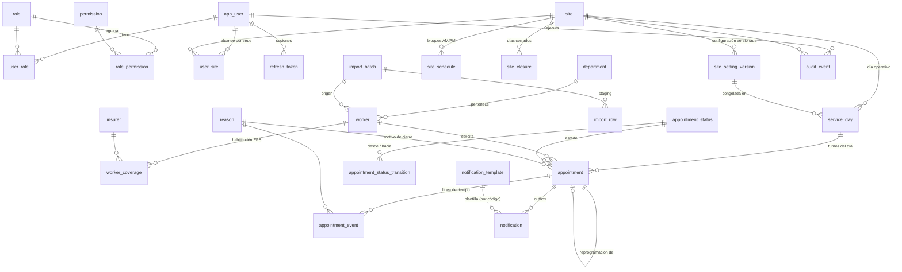

# Modelo de datos — Tópico CSJ Lima

> Complementa a `03-diccionario-datos.md`, que se genera automáticamente desde la BD con el detalle de columnas, restricciones e índices.
> El DDL fuente está en `backend/alembic/sql/`. El DDL consolidado para revisión de un DBA está en `database/schema.sql`.

## 1. Diagrama entidad-relación

## 2. Módulos y tablas

| Módulo | Tablas | Notas |
|---|---|---|
| Seguridad | `app_user`, `role`, `permission`, `role_permission`, `user_role`, `user_site`, `refresh_token` | RBAC por permisos y alcance por sede. Solo se guarda el hash del refresh token. |
| Configuración | `system_parameter`, `site`, `site_setting_version`, `site_schedule`, `site_closure` | Ningún parámetro de negocio está en el código. |
| Trabajadores | `department`, `insurer`, `worker`, `worker_coverage` | La habilitación EPS tiene vigencias sin solapamiento. |
| Importación | `import_batch`, `import_row` | Staging: nada llega a las tablas finales sin validación y confirmación. |
| Agenda / cola | `service_day`, `appointment`, `appointment_status`, `appointment_status_transition`, `appointment_event`, `reason` | Núcleo operativo. |
| Notificaciones | `notification_template`, `notification` | Patrón outbox. |
| Auditoría | `audit_event` | Solo inserción, con cadena de hash. |

## 3. Decisiones de diseño

### 3.1 Identificadores
- PK internas `bigint`/`integer GENERATED ALWAYS AS IDENTITY`. No se usa `serial`.
- `public_id uuid` en los recursos que expone la API (usuarios, trabajadores, atenciones, lotes). Así se evita la enumeración de IDs.
- **DNI** en `varchar(12)`, con CHECK por tipo de documento: DNI = 8 dígitos exactos. Conserva los ceros iniciales.

### 3.2 Tiempo
- Instantes: `timestamptz`. La base está configurada con `timezone = UTC`.
- Fecha operativa: `date` (`service_date`), calculada en `America/Lima` por la aplicación.
- Horarios: `time` interpretado en la zona de la sede (`site.timezone`).
- La edad **no** se guarda: se deriva de `birth_date` si existe.

### 3.3 Capacidad, numeración y concurrencia (garantizadas por la BD)

`service_day` es el **punto de serialización**. Al abrir el día, `ensure_service_day()` congela la configuración vigente. Luego:

| Operación | Mecanismo |
|---|---|
| Registrar atención | El trigger `tg_appointment_before_insert` hace `UPDATE service_day` (bloquea la fila), incrementa `last_ticket_number` y `occupied_count`, y asigna el turno, la sede y la fecha. Si se excede la capacidad, falla `ck_service_day_capacity`. |
| Cancelar / no presentado / anular | `tg_appointment_before_update` descuenta `occupied_count` en la misma transacción. |
| Contadores | La aplicación **no tiene privilegio** para escribirlos. Solo los modifican triggers `SECURITY DEFINER`. |
| Trabajador duplicado | Índice único parcial `uq_appointment_worker_active_day`. |
| Llamar siguiente | `SELECT … FOR UPDATE SKIP LOCKED` (patrón probado en `test_concurrency.py`). |

La aplicación igualmente valida antes de insertar, para dar mensajes claros. La BD es la **última línea de defensa**, no la única.

### 3.4 Máquina de estados

`appointment_status_transition` enumera las 11 transiciones permitidas y el trigger rechaza cualquier otra (`ck_appointment_status_transition`). Además:
- Los estados finales son inmutables (`ck_appointment_final_immutable`).
- Los campos de identidad del turno son inmutables (`ck_appointment_immutable_fields`), incluso para el rol propietario.
- CHECKs de coherencia estado ↔ datos: un `LLAMADO` exige `called_at/called_by`; un `CANCELADO` exige motivo, etc.

| Estado | Ocupa cupo | Final |
|---|---|---|
| REGISTRADO, EN_ESPERA, LLAMADO, EN_ATENCION | sí | no |
| ATENDIDO | sí | sí |
| CANCELADO, NO_PRESENTADO, ANULADO | no | sí |

### 3.5 Configuración versionada
`site_setting_version` guarda la capacidad, la duración del turno, la tolerancia, etc., con `valid_from`. Una versión ya vigente es **inmutable** (trigger): para cambiarla se crea una nueva versión. Así el histórico explica con qué reglas operó cada día.

### 3.6 Auditoría inviolable
1. `topico_app` solo tiene `INSERT, SELECT` sobre `audit_event`.
2. Los triggers bloquean `UPDATE/DELETE/TRUNCATE` incluso al propietario.
3. Cadena de hash: `hash = sha256(contenido ‖ prev_hash)` con `chain_seq` sin huecos. `SELECT * FROM topico.verify_audit_chain();` devuelve 0 filas si la auditoría está íntegra; si alguien desactivó triggers y alteró o borró filas, reporta `HASH_MISMATCH`, `SEQUENCE_GAP` o `PREV_HASH_MISMATCH`.

### 3.7 Mínimo privilegio

| Rol | Uso | Privilegios |
|---|---|---|
| `topico_owner` | migraciones, backups | dueño del esquema |
| `topico_app` | backend | `SELECT` en todo; `INSERT/UPDATE` según tabla; `UPDATE` **por columna** en `appointment` y `service_day`; sin `DELETE` en tablas de negocio; sin DDL |
| `topico_readonly` | reportes/BI (rol de grupo sin login) | `SELECT` |

### 3.8 Privacidad
- No existen columnas clínicas. `admin_note` es administrativa, está limitada a 300 caracteres y su comentario prohíbe datos clínicos (la UI lo recordará).
- `audit_event.before_data/after_data` nunca debe contener contraseñas ni tokens (responsabilidad del backend).

## 4. Supuestos de datos iniciales a confirmar
- Tolerancia de 10 minutos en ambas sedes.
- Sede Anselmo Barreto: configurada igual que Alzamora (20 cupos, 15 min, 08–12 / 14–17).
- Horario de lunes a viernes.
- Todo se ajusta desde Administración sin tocar código. También se puede ajustar ahora vía SQL, creando una nueva `site_setting_version`.
