# Manual de usuario

**Sistema de Gestión de Atención del Tópico de Salud — Corte Superior de Justicia de Lima**

Contenido:
1. Ingreso al sistema
2. Encargada del tópico: la Mesa de atención
3. Consulta del turno (para trabajadores)
4. Supervisión: reportes, sedes y horarios
5. Administración
6. Auditoría
7. Preguntas frecuentes

---

## 1. Ingreso al sistema

1. Abra el navegador (Edge o Chrome) e ingrese la dirección que le indicó TI, por ejemplo `https://<servidor>:42000`.
2. Escriba su **usuario** y su **contraseña** y pulse **Ingresar**.
3. **La primera vez**, el sistema le pedirá definir una contraseña personal: al menos 10 caracteres, con letras y números, y sin su nombre de usuario.

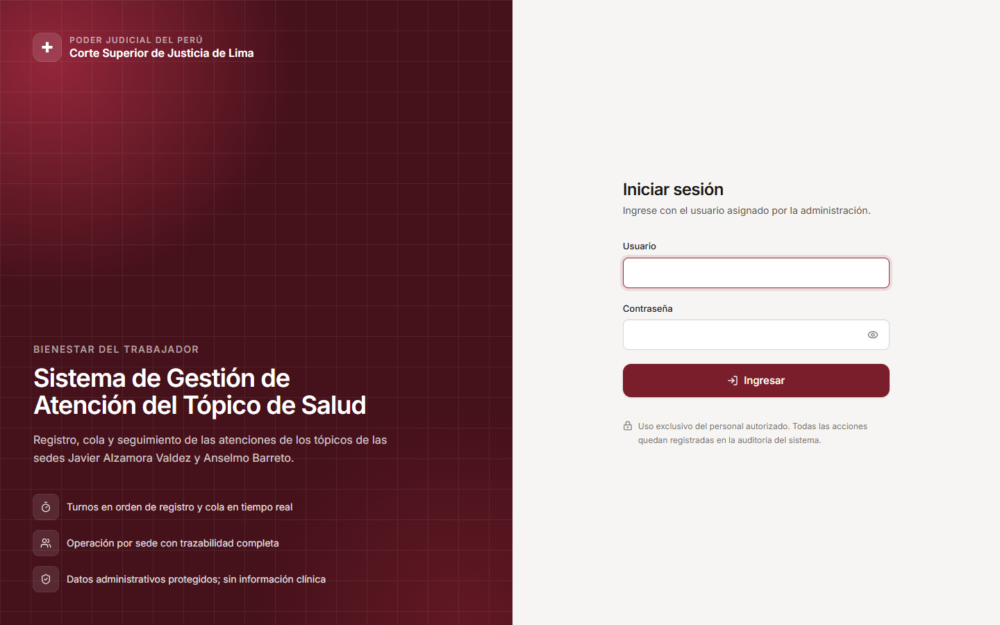

- Tras 5 intentos fallidos la cuenta se bloquea 15 minutos. Si lo necesita antes, el administrador puede desbloquearla.
- Por seguridad, la sesión dura como máximo una jornada. Para salir use el menú con su nombre (arriba a la derecha) → **Cerrar sesión**.
- Si trabaja en más de una sede, elija la **sede de trabajo** en la parte superior de la pantalla.

---

### 1.1 Accesibilidad: tamaño de letra y alto contraste
El botón **T** (arriba a la derecha, y también en el inicio de sesión y en la consulta del trabajador) permite:
- **agrandar o reducir la letra** (100 %, 112 %, 125 % o 150 %). El diseño se reacomoda sin cortar contenido;
- activar el **alto contraste**: textos y bordes más oscuros, enlaces subrayados y foco más visible.

La preferencia se recuerda **en ese equipo** (cada computadora o celular puede tener la suya). **Restablecer** vuelve a lo normal.

---

## 2. Encargada del tópico: la Mesa de atención

La Mesa de atención reúne todo lo necesario para la operación del día.

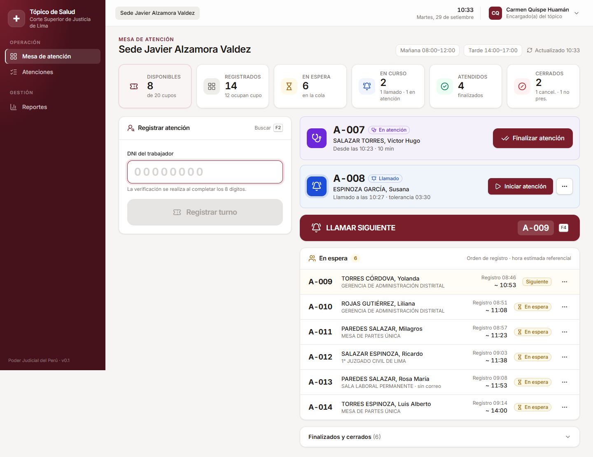

| Zona | Qué muestra |
|---|---|
| Indicadores (arriba) | Cupos **disponibles**, registrados, en espera, en curso (llamados y en atención), atendidos y cerrados |
| Registrar atención (izquierda) | Búsqueda por DNI y registro del turno |
| En atención / Llamados | Quién está siendo atendido y a quién se llamó (con la cuenta regresiva de tolerancia) |
| **LLAMAR SIGUIENTE** | Llama al siguiente turno en orden de registro |
| En espera | La cola, en orden, con la hora estimada referencial |

La pantalla se actualiza sola cada pocos segundos.

### 2.1 Registrar una atención (llamada telefónica o presencial)

1. Pulse **F2** (o haga clic en el campo DNI) y escriba los **8 dígitos** del DNI.
2. El sistema verifica automáticamente al trabajador:
   - ✅ **Habilitado · EPS Rímac vigente**: puede registrarlo.
   - ❌ **No habilitado**: no existe, está inactivo o no tiene cobertura EPS Rímac. No se puede registrar.
   - ⚠️ **Ya tiene turno**: se muestra su turno actual.
   - También indica si el trabajador **tiene correo**: si no lo tiene, no recibirá avisos, así que infórmele su turno de palabra.

   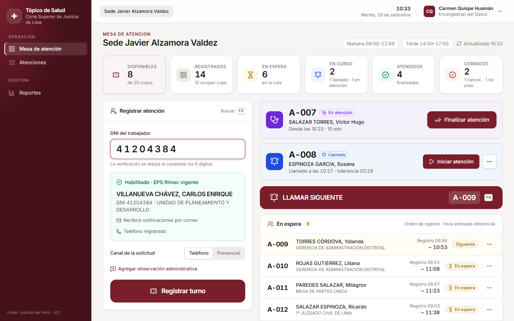

3. Indique el **canal**: *Teléfono* o *Presencial*.
4. Opcionalmente, agregue una **observación administrativa**.

   > ⚠️ **No registre síntomas, diagnósticos ni información clínica.** El sistema es administrativo.

5. Pulse **Registrar turno**. Aparece el **turno generado** en grande, con la posición y la hora estimada: díctelos al trabajador.

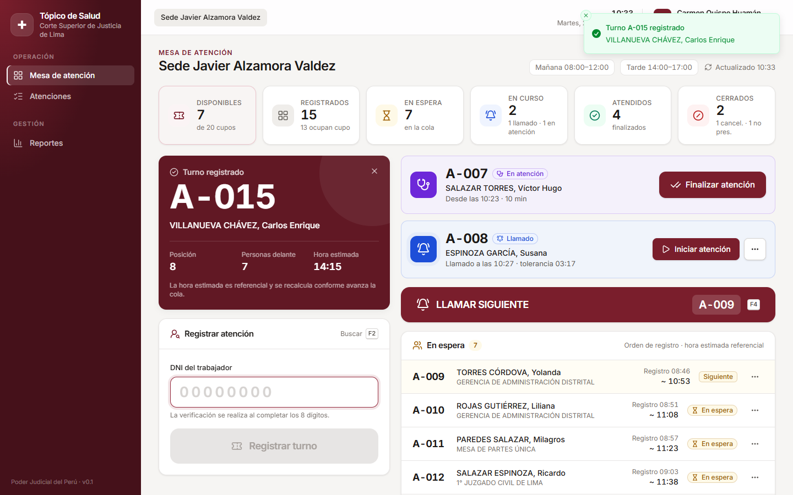

**Mensajes que puede ver:**

| Mensaje | Significado |
|---|---|
| "Se ha alcanzado la capacidad máxima de atención…" | No quedan cupos para hoy en la sede |
| "El horario de registro de atenciones para hoy ha concluido" | Se superó la hora de cierre de registros |
| "El tópico de esta sede no atiende en la fecha seleccionada" | Día marcado como cerrado (feriado u otro motivo) |
| "Según la configuración de la sede, el trabajador no puede volver a registrarse hoy" | Ya se le marcó como no presentado hoy |

### 2.2 Llamar, atender y finalizar

1. Pulse **LLAMAR SIGUIENTE**, o la tecla **F4**. El siguiente turno pasa a **Llamado** y, si tiene correo, recibe el aviso "acérquese al tópico". Puede además llamarlo por teléfono.
2. Cuando el trabajador llega, pulse **Iniciar atención** (estado **En atención**).
3. Al terminar, pulse **Finalizar atención** (estado **Atendido**).

Por defecto solo puede haber **una atención en curso** a la vez por sede (un médico). Finalice la actual antes de iniciar otra.

### 2.3 Si el trabajador no llega

- En la tarjeta del llamado se ve la **tolerancia** (p. ej., "tolerancia 06:56").
- Cuando vence, se habilita **No se presentó**, que libera el cupo.
- Si el trabajador avisa que llegará más tarde, use **⋯ → Devolver a la cola**: conserva su número y su lugar.

### 2.4 Cancelar o anular

Desde el botón **⋯** de cada turno:

| Acción | Cuándo usarla | Efecto |
|---|---|---|
| **Cancelar** | El trabajador ya no requiere la atención (p. ej., "me atenderé en una clínica") | Libera el cupo; se registra el motivo |
| **Anular** | **Error de registro** (persona o sede equivocada, duplicado) | Libera el cupo; no cuenta como demanda en los reportes |

Ambas piden un **motivo**. Si elige "Otro motivo", debe escribir una observación.

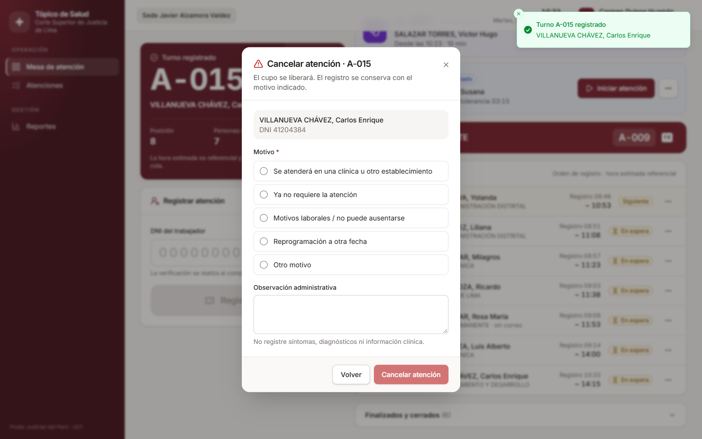

Ningún registro se elimina: todo queda en el historial.

### 2.5 Estados de una atención

| Estado | Significado |
|---|---|
| 📝 **Registrado** | Solicitud para una fecha futura |
| ⏳ **En espera** | En la cola del día |
| 🔔 **Llamado** | Se le pidió acercarse al tópico |
| 🩺 **En atención** | Está siendo atendido |
| ✅ **Atendido** | Atención concluida |
| ✖ **Cancelado** | El trabajador desistió; cupo liberado |
| ⊘ **No presentado** | No acudió tras el llamado; cupo liberado |
| ⌫ **Anulado** | Error de registro; cupo liberado |

### 2.6 Historial y detalle

En **Atenciones** puede buscar por fecha, estado, sede o DNI. Al hacer clic en una atención verá su **línea de tiempo** (quién hizo cada acción y cuándo) y los **correos** enviados. Desde ahí puede reenviar un correo.

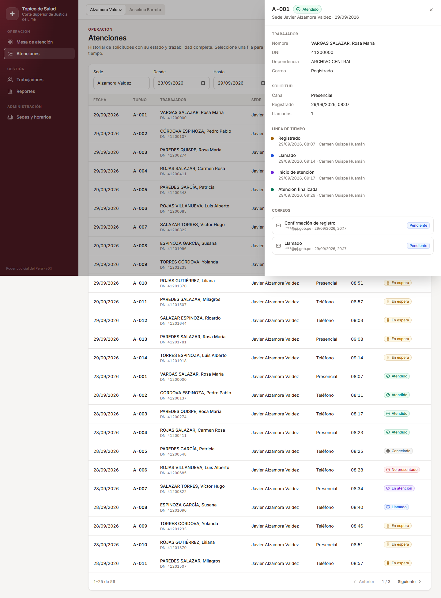

### 2.7 Atajos de teclado

| Tecla | Acción |
|---|---|
| **F2** | Ir al campo DNI |
| **F4** | Llamar siguiente |
| **Esc** | Cerrar ventana o diálogo |

### 2.7.1 Atención prioritaria (si está habilitada)
La institución puede habilitar la **atención prioritaria** (parámetro `priority.enabled`, **desactivado por defecto**). Mientras está desactivada, la cola respeta estrictamente el orden de registro.

Cuando está habilitada:
- al registrar, se elige si la persona es **Gestante**, **Adulto mayor (60 años o más)** o **Persona con discapacidad**. Solo se registra la categoría, nunca diagnósticos ni detalles de salud;
- también se puede marcar o quitar después, desde el menú **⋯** del turno en espera (**Marcar como prioritaria**);
- **regla de llamado:** las atenciones prioritarias se llaman antes, en su orden de registro. Para que nadie espere indefinidamente, tras **3 llamados prioritarios seguidos** (parámetro `priority.max_consecutive`) se llama a la siguiente persona en orden normal;
- la Mesa muestra el distintivo **Prioritaria**; la **pantalla de sala no muestra la categoría**, solo el orden;
- cada asignación o retiro queda en la línea de tiempo de la atención y en la auditoría. Las categorías se administran en *Catálogos → Motivos* (tipo «Prioridad»).

### 2.8 Ticket impreso
Tras registrar un turno, el botón **Imprimir turno** imprime un ticket (impresora térmica de 80 mm o una hoja A6) con el turno, la sede, las personas delante, la hora estimada y un **código QR**. Al escanearlo con el celular se abre la consulta del turno con el DNI y el código ya cargados. También se puede reimprimir desde el detalle de la atención.

### 2.9 Pausar la atención
**Pausar atención** (refrigerio, emergencia, reunión…) pide un motivo y una duración aproximada:
- la pantalla de sala muestra «Atención en pausa — retomamos a las 13:00»;
- las horas estimadas se recalculan desde la hora de reanudación;
- se reanuda con **Reanudar** o automáticamente al **llamar al siguiente**.

Todo queda en la auditoría.

### 2.10 Cerrar el día
Al terminar la jornada, la supervisora (permiso «Cerrar el día operativo») pulsa **Cerrar día**:
- si hay una atención en curso, primero debe finalizarse;
- quienes quedaron registrados, en espera o llamados pasan a **no presentado** con el motivo «No fue atendido al cierre de la jornada»;
- ya no se pueden registrar ni llamar turnos en esa fecha;
- se **envía por correo el resumen del día en PDF** a las supervisoras de la sede (y a quien cerró), y se puede descargar al momento.

> Si la encargada también debe cerrar el día, el administrador puede dar ese permiso a su rol en *Usuarios y roles → Roles y permisos*.

---

## 3. Consulta del turno (para trabajadores)

Los trabajadores pueden ver el estado de su turno desde su celular o PC en `http://<servidor>:42000/consulta`, ingresando su **DNI** y el **código de turno** (p. ej., A-011).

Verán su posición, cuántas personas tienen delante y la hora aproximada. Por privacidad, la consulta no muestra datos de otras personas.

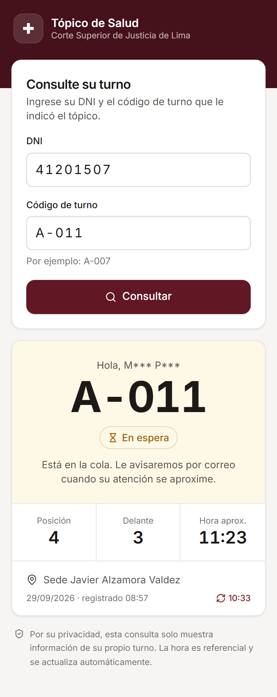

### 3.1 Pantalla de turnos de la sala de espera (TV)

Una TV o monitor en la sala de espera puede mostrar, en tiempo real, **a quién se está llamando** y **quiénes siguen**:

- Dirección: `http://<servidor>:42000/pantalla` → elegir la sede (p. ej. `http://172.20.1.51:42000/pantalla/alz`). No requiere usuario ni contraseña.
- La encargada también la abre desde la **Mesa de atención** con el botón **Pantalla de sala** (se abre en otra pestaña, para arrastrarla a la TV).
- Al abrirla, pulse **Iniciar pantalla**: pasa a pantalla completa y cada llamado se anuncia con una **campanilla y por voz** ("Turno A 11. Milagros P. Por favor, acérquese al tópico"). Si se vuelve a llamar a alguien, se anuncia de nuevo.
- Se actualiza sola cada 4 segundos. El indicador **EN LÍNEA** pasa a **RECONECTANDO** si se pierde la red; al volver, continúa sola.
- Al mover el mouse aparecen los botones de silenciar y de pantalla completa.

Por privacidad solo se muestra el **código de turno y el nombre abreviado** (nombre + inicial del apellido). Nunca DNI, correo, dependencia ni datos de salud. El administrador puede, en *Configuración → Parámetros*:

| Parámetro | Efecto |
|---|---|
| `display.enabled` | Activa o desactiva la pantalla |
| `display.show_names` | Si es "No", muestra solo el código de turno |
| `display.voice_enabled` | Si es "No", solo suena la campanilla |
| `display.message` | Mensaje informativo al pie de la pantalla |

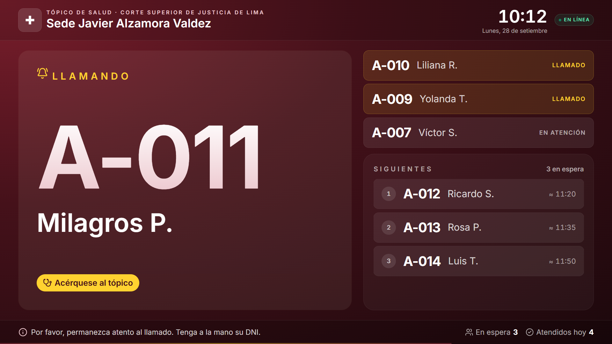

---

## 4. Supervisión

### 4.0 Panel en vivo
**Panel en vivo** muestra todas las sedes a la vez y se actualiza cada 10 segundos. Por sede indica:
- personas en espera, en atención (con médico y consultorio), atendidos y cupos libres;
- la mayor espera actual (en rojo desde 45 minutos) y la espera promedio del día;
- si la sede está en pausa o con la jornada cerrada;
- alertas: tolerancias vencidas, capacidad agotada y correos que no se pudieron enviar.

**Ir a la mesa** abre la Mesa de atención de esa sede.

### 4.1 Reportes

**Reportes** muestra los indicadores del periodo elegido (7, 30 o 90 días, o un rango personalizado):
- solicitudes, atendidos, uso de cupos, inasistencia, espera promedio y duración promedio;
- resultado diario frente a la capacidad, demanda por hora y dependencias con más solicitudes;
- tabla detallada por día y sede.

El botón **Exportar** descarga el reporte del periodo y la sede elegidos:
- **Reporte de indicadores en PDF:** documento institucional listo para imprimir o enviar, con los indicadores, el gráfico de atendidos por día y las tablas por médico, canal, hora, dependencia y día.
- **Reporte de indicadores en Excel:** el mismo contenido en hojas separadas (Resumen, Por día, Por médico, Por dependencia, Por canal y Por hora), para analizarlo o hacer gráficos propios.
- **Detalle por día (CSV).**

Estos reportes no tienen datos personales, así que puede descargarlos cualquier usuario con acceso a Reportes. El **listado nominal** (PDF, Excel o CSV, con nombre y DNI de cada atención) requiere los permisos de exportación y de listado nominal. Toda descarga queda en la auditoría.

**Satisfacción del servicio:** al finalizar cada atención, el trabajador recibe por correo un enlace para calificar el **trato** y el **tiempo de espera** (1 a 5 estrellas), con un comentario opcional. Es **anónimo**: los reportes solo muestran promedios, la distribución y los comentarios sin nombre. No se pregunta nada sobre la salud. El enlace vence en 7 días (parámetro `rating.valid_days`) y la encuesta se desactiva con `rating.enabled`.

La tarjeta **Atenciones por médico** muestra cuántas atenciones finalizó cada médico y su duración promedio.

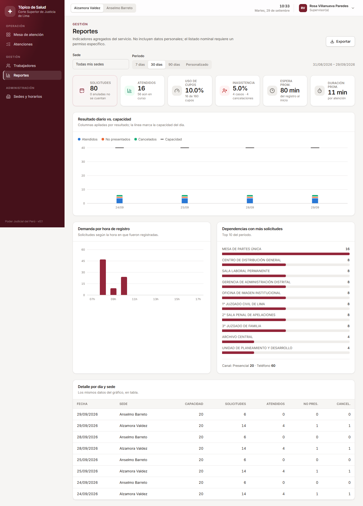

### 4.2 Sedes y horarios

**Sedes con tópico** (solo administrador): lista de todas las sedes, incluidas las inactivas, con acceso a su pantalla de sala.
- **Nueva sede:** cuando se habilite un tópico en otra sede, regístrela con su nombre, código (p. ej. `SJL`, que también es la dirección de su pantalla: `/pantalla/sjl`), prefijo de turnos (p. ej. `C` → C-001), capacidad, duración de la atención, tolerancia, días y horario de mañana/tarde. Queda operativa desde la fecha de inicio indicada y los administradores obtienen acceso automáticamente. Para que otras personas la operen, asígneles la sede en **Usuarios y roles**.
- **Desactivar / Activar:** una sede inactiva deja de aparecer en el selector y en la pantalla de sala; su historial se conserva.

Debajo, las pestañas configuran la **sede elegida en el selector superior**:
- **Configuración:** capacidad diaria, duración de turno, tolerancia, atenciones simultáneas, avisos por correo y reglas de re-registro. Los cambios se **programan desde una fecha futura**: el día en curso no se altera.
- **Horario:** bloques de mañana y tarde por día de la semana.
- **Consultorios:** los consultorios del tópico (p. ej., «Consultorio 1», «Consultorio 2») con su ubicación. Al llamar, la persona ve en la pantalla de sala y en el correo **a qué consultorio acercarse**. Si hay un solo consultorio activo se asigna solo; si hay varios, la encargada elige en la Mesa de atención **desde qué consultorio llama** (el equipo lo recuerda). Un consultorio que deja de usarse se desactiva.
- **Pantalla de sala:** mensajes que rotan al pie de la pantalla (avisos, campañas de salud), con fechas de vigencia y orden. El administrador puede publicar un mensaje para **todas las sedes**. Al pie de la pestaña se configura cuántos **segundos** se muestra cada mensaje antes de pasar al siguiente (parámetro global `display.message_seconds`, por defecto 10; requiere permiso de parámetros).
- **Médicos:** los médicos que atienden en el tópico de la sede (nombre, CMP, DNI, especialidad, teléfono). Al pulsar **Iniciar** en la Mesa de atención se registra qué médico atiende: si la sede tiene un solo médico activo se asigna solo; si tiene varios, el sistema pregunta cuál. Un médico que deja de atender se **desactiva** (su historial se conserva).
  - **Horario:** días y horas en que atiende cada médico (p. ej., lun–mié 8:00–12:00). Sin horario propio, se considera disponible en todo el horario de la sede. Al iniciar una atención, la mesa ofrece primero a los médicos **de turno**.
  - **Ausencias:** vacaciones, licencia o capacitación (con fechas y motivo administrativo). Ese día el médico no aparece para asignar.
  - **Capacidad calculada:** si algún médico tiene horario, la capacidad del día se calcula con los **médicos presentes** (minutos de atención ÷ duración del turno), sin superar la capacidad configurada. Una ausencia la reduce automáticamente; un ajuste manual de *Capacidad del día* siempre prevalece. Se desactiva con el parámetro `capacity.by_doctor_schedule`.
- **Cierres:** feriados o días sin atención; bloquean el registro en esas fechas.
- **Capacidad del día:** ajuste puntual de un día (p. ej., el médico atenderá medio turno), con motivo obligatorio.
- **Datos de la sede:** nombre y ubicación del tópico (aparece en los correos de llamado).

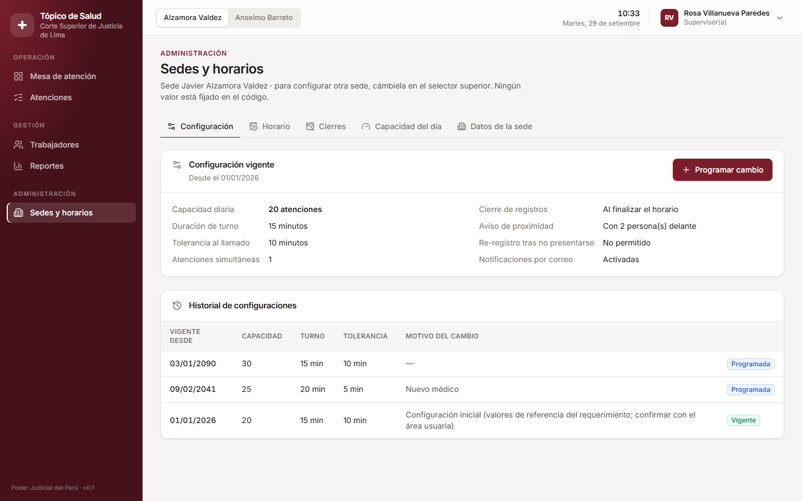

---

## 5. Administración

### 5.1 Usuarios y roles

- **Nuevo usuario:** usuario, nombre, correo, **roles** y **sedes autorizadas**. El sistema genera una **contraseña temporal** que se muestra **una sola vez**: entréguela de forma segura.
- Desde la lista puede **restablecer** la contraseña, **desbloquear** o **desactivar** una cuenta.
- La pestaña **Roles y permisos** permite ajustar qué puede hacer cada rol. Todo cambio queda auditado.

| Rol | Uso típico |
|---|---|
| Encargado(a) del tópico | Opera la mesa de su sede |
| Supervisor(a) | Opera, configura su sede, ve y exporta reportes |
| Administrador(a) | Usuarios, roles, importaciones, catálogos y parámetros (no opera la cola) |
| Auditor(a) | Solo consulta la auditoría y los reportes |

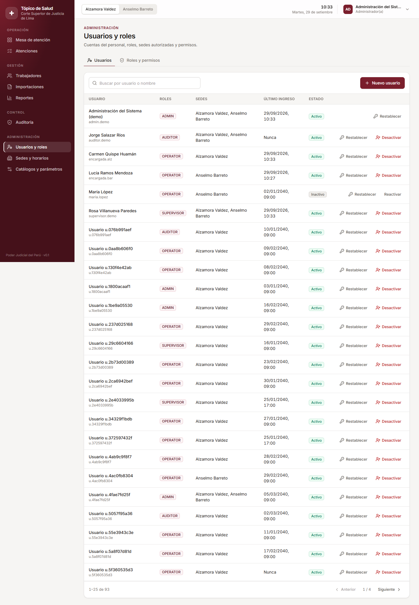

### 5.2 Trabajadores e importación

- **Trabajadores:** búsqueda por DNI o nombre, ficha, alta manual, edición y cobertura EPS. Cada consulta de ficha queda registrada, porque se trata de un dato personal.
- **Importaciones**, para actualizar la relación de EPS Rímac desde el Excel institucional:
  1. Arrastre o seleccione el archivo **.xlsx**.
  2. Revise el resultado: **nuevos**, **actualizan**, **sin cambios**, **duplicados** y **errores**, fila por fila. Puede descargar el reporte de observaciones.
  3. Pulse **Confirmar importación**. Solo si el archivo es la relación **completa** vigente, active *"Terminar la cobertura de quienes no figuran"*.

  Nada se incorpora hasta confirmar. El mismo archivo no puede importarse dos veces.

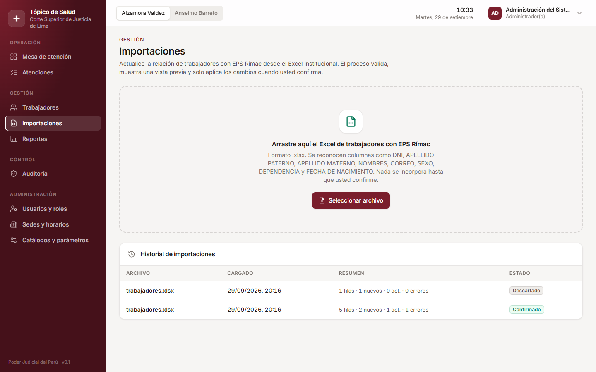

### 5.3 Catálogos y parámetros

- **Motivos:** textos ofrecidos al cancelar, anular, etc. Pueden desactivarse sin perder el historial.
- **Plantillas de correo:** editables, con variables (`{{ ticket_code }}`, etc.) y **vista previa**.
- **Parámetros:** valores generales, como los intentos de ingreso, el tiempo de bloqueo y los días de anticipación.

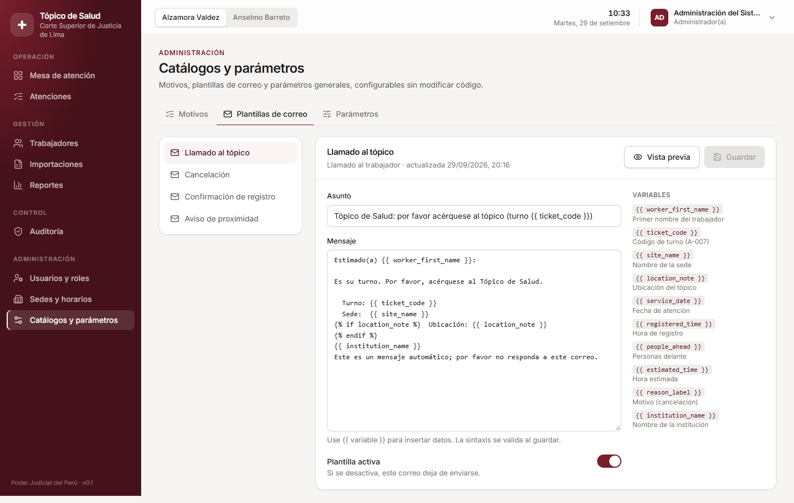

---

### 5.4 Identidad visual
En *Catálogos y parámetros →* **Identidad visual** (administrador):
- **Logo:** cargue el logo oficial (PNG o JPEG de hasta 512 KB; de preferencia PNG con fondo transparente). Aparece en la interfaz, el inicio de sesión, la pantalla de sala, la consulta del trabajador y el encabezado de los **PDF**. **Quitar logo** vuelve a la marca por defecto.
- **Color institucional:** la interfaz, la pantalla de sala, los correos y los PDF adoptan el color (los tonos claros y oscuros se generan solos). **Predeterminado** vuelve al granate inicial.
- **Organización e institución:** nombres que se muestran en los encabezados.

Los **correos** se envían también en formato HTML, con un encabezado del color institucional y los nombres configurados.

> Use el logo y los colores del **manual de identidad visual oficial** del Poder Judicial.

---

## 6. Auditoría

**Auditoría** registra cada acción relevante: quién, cuándo, desde qué IP, sobre qué registro, y los valores anteriores y nuevos. Se puede filtrar por fecha, usuario, acción, resultado y sede.

El botón **Verificar integridad** comprueba que ningún evento haya sido alterado o eliminado: cada evento está encadenado criptográficamente con el anterior.

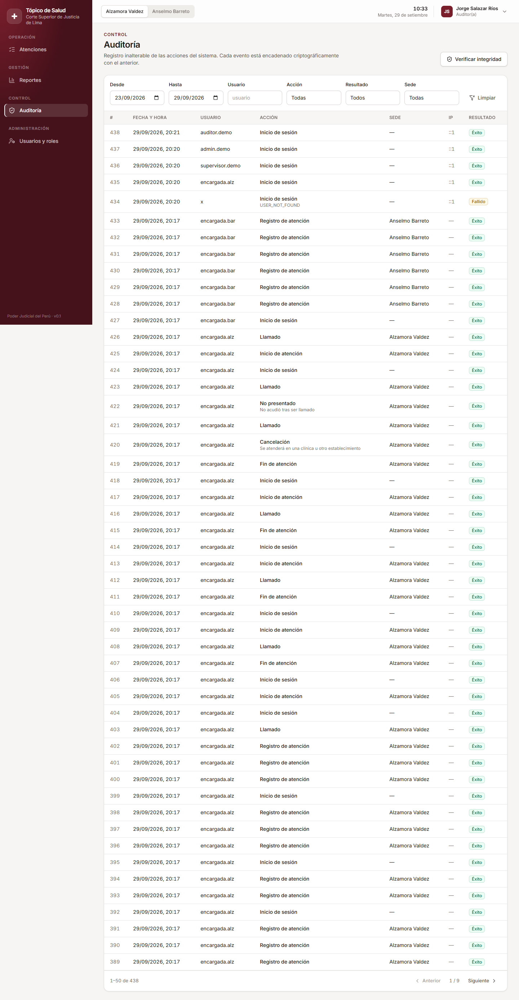

---

## 7. Preguntas frecuentes

**¿Puedo registrar a alguien que no aparece como habilitado?**
No. Solo se registran trabajadores con EPS Rímac vigente. Si debería estar habilitado, el administrador debe actualizar la relación (Importaciones) o su ficha (Trabajadores).

**Un trabajador canceló por error. ¿Puedo revertirlo?**
No: los estados finales no se modifican. Registre una nueva atención. Tendrá un nuevo número de turno, al final de la cola.

**La hora estimada no se cumplió.**
Es referencial: se calcula con la duración configurada del turno y se recalcula conforme avanza la cola.

**¿Por qué no puedo marcar "No se presentó"?**
Porque aún no vence la tolerancia desde el llamado. La tarjeta muestra la cuenta regresiva.

**Apareció "La atención fue modificada por otro usuario".**
Otra persona actuó sobre esa atención al mismo tiempo. La pantalla se actualizó: revise el estado e intente de nuevo si corresponde.

**Veo "No se pudo conectar con el servidor".**
Verifique su conexión a la red institucional. Si persiste, informe a TI el **código de solicitud** que aparece en el mensaje.
